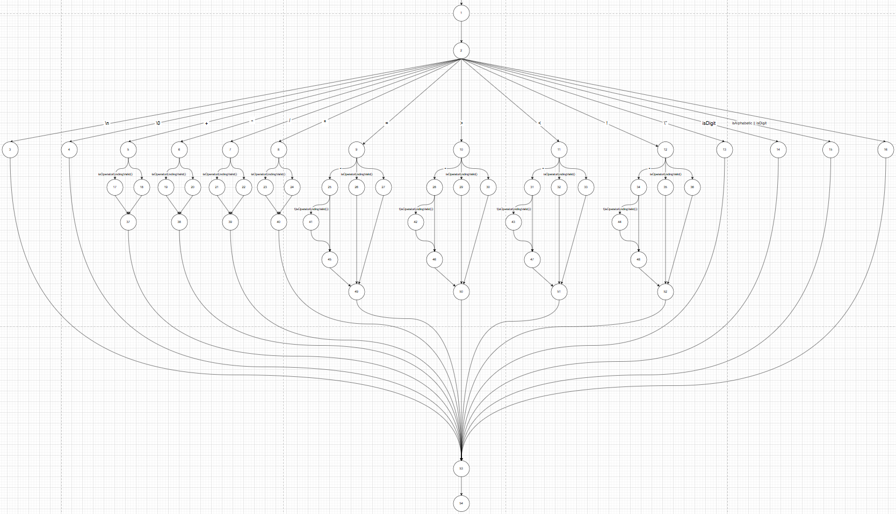
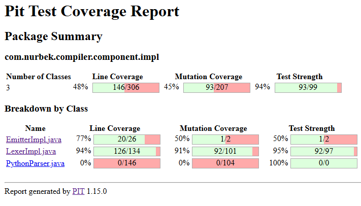
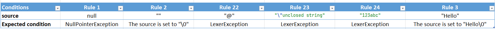
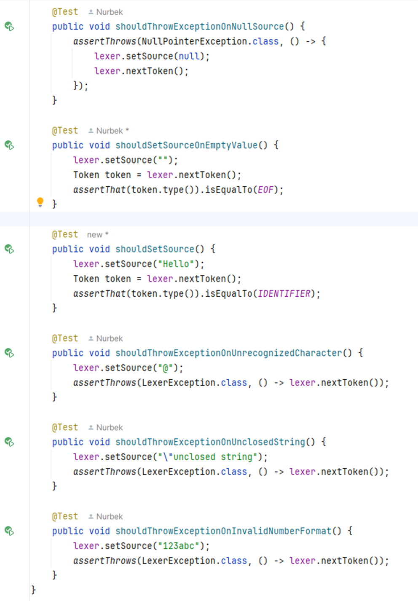

# Quantum Compiler 1

This compiler will compile the code that looks like BASIC to a python program :-D

Tutorial: [Teeny Tiny Compiler](https://austinhenley.com/blog/teenytinycompiler1.html)

```basic
PRINT "How many fibonacci numbers do you want?"
INPUT nums

LET a = 0
LET b = 1
WHILE nums > 0 REPEAT
    PRINT a
    LET c = a + b
    LET a = b
    LET b = c
    LET nums = nums - 1
ENDWHILE
```

The language compiler supports:
* Numerical variables 
* Basic arithmetic 
* If statements 
* While loops
* Print text and numbers
* Input numbers
* Comments

### Language Grammar
```grammar
program ::= {statement}
statement ::= "PRINT" (expression | string) nl
| "IF" comparison "THEN" nl {statement} "ENDIF" nl
| "WHILE" comparison "REPEAT" nl {statement} "ENDWHILE" nl
| "LET" ident "=" expression nl
| "INPUT" ident nl
comparison ::= expression (("==" | "!=" | ">" | ">=" | "<" | "<=") expression)+
expression ::= term {( "-" | "+" ) term}
term ::= unary {( "/" | "*" ) unary}
unary ::= ["+" | "-"] primary
primary ::= number | ident
nl ::= '\n'+
```
<br>

---

## BASIS PATH TESTING
Flowchart of the `nextToken()` method in the `com.nurbek.compiler.component.impl.LexerImpl` class:

See `Flowchart_basis_path.drawio` (Open it with `draw.io` webapp in the browser)



```java
public Token nextToken() {
    checkSource(source);

    skipComment();
    skipWhitespace();

    Token token = null;

    if (currChar == '\n') {
        token = new TokenImpl("\n", Token.TokenType.NEWLINE);

    } else if (currChar == '\0') {
        token = new TokenImpl("\0", Token.TokenType.EOF);

    } else if (currChar == '+') {

        if (isOperatorEndingValid()) {
            token = new TokenImpl("+", Token.TokenType.PLUS);
        } else {
            abort("Invalid operator '+" + peekChar() + "'");
        }

    } else if (currChar == '-') {

        if (isOperatorEndingValid()) {
            token = new TokenImpl("-", Token.TokenType.MINUS);
        } else {
            abort("Invalid operator '-" + peekChar() + "'");
        }

    } else if (currChar == '/') {

        if (isOperatorEndingValid()) {
            token = new TokenImpl("/", Token.TokenType.SLASH);
        } else {
            abort("Invalid operator '/" + peekChar() + "'");
        }

    } else if (currChar == '*') {

        if (isOperatorEndingValid()) {
            token = new TokenImpl("*", Token.TokenType.ASTERISK);
        } else {
            abort("Invalid operator '*/" + peekChar() + "'");
        }

    } else if (currChar == '=') {

        if (peekChar() == '=') {
            token = new TokenImpl("==", Token.TokenType.EQUALS);
            nextChar();

            if (!(isOperatorEndingValid())) {
                abort("Invalid operator '==" + peekChar() + "'");
            }
        } else if (isOperatorEndingValid()) {
            token = new TokenImpl("=", Token.TokenType.EQUAL);
        } else {
            abort("Invalid operator '=" + peekChar() + "'");
        }

    } else if (currChar == '>') {

        if (peekChar() == '=') {
            token = new TokenImpl(">=", Token.TokenType.GREATER_EQUAL);
            nextChar();

            if (!(isOperatorEndingValid())) {
                abort("Invalid operator '>=" + peekChar() + "'");
            }
        } else if (isOperatorEndingValid()) {
            token = new TokenImpl(">", Token.TokenType.GREATER);
        } else {
            abort("Invalid operator '>" + peekChar() + "'");
        }

    } else if (currChar == '<') {

        if (peekChar() == '=') {
            token = new TokenImpl("<=", Token.TokenType.LESS_EQUAL);
            nextChar();

            if (!(isOperatorEndingValid())) {
                abort("Invalid operator '<=" + peekChar() + "'");
            }
        } else if (isOperatorEndingValid()) {
            token = new TokenImpl("<", Token.TokenType.LESS);
        } else {
            abort("Invalid operator '<" + peekChar() + "'");
        }

    } else if (currChar == '!') {

        if (peekChar() == '=') {
            token = new TokenImpl("!=", Token.TokenType.NOTEQUAL);
            nextChar();

            if (!(isOperatorEndingValid())) {
                abort("Invalid operator '!=" + peekChar() + "'");
            }
        } else {
            abort("Invalid operator '!" + peekChar() + "'");
        }

    } else if (currChar == '\"') { // string
        token = getStringToken();

    } else if (Character.isDigit(currChar)) { // numbers
        token = getNumberToken();

    } else if (Character.isAlphabetic(currChar) || Character.isDigit(currChar)) { // keywords or identifiers
        token = getKeywordToken();

    } else {
        abort("Invalid Token");
    }

    nextChar();

    return token;
}
```

White-box tests for each path are written in the `com.nurbek.component.LexerUnitTest` test file.

---

## Mutant Code
Mutant code is generated with a help of a maven tool `PIT`. 
To enable it the plugin was included in the `pom.xml` file:
```xml
<plugin>
    <groupId>org.pitest</groupId>
    <artifactId>pitest-maven</artifactId>
    <version>${pitest.maven.version}</version>

    <!--attach execution to maven's test phase-->
    <executions>
        <execution>
            <id>pit-report</id>
            <phase>test</phase>
            <goals>
                <goal>mutationCoverage</goal>
            </goals>
        </execution>
    </executions>

    <!--allows to work with JUnit 5-->
    <dependencies>
        <dependency>
            <groupId>org.pitest</groupId>
            <artifactId>pitest-junit5-plugin</artifactId>
            <version>1.2.1</version> <!-- Ensure compatibility with JUnit 5 -->
        </dependency>
    </dependencies>

    <!--optional-->
    <configuration>
        <targetClasses>
            <param>com.nurbek.compiler.component.impl*</param>
        </targetClasses>
        <targetTests>
            <param>com.nurbek.compiler.component*</param>
        </targetTests>

        <verbose>true</verbose>
        <outputFormats>
            <param>HTML</param>
        </outputFormats>
    </configuration>
</plugin>
```

You can access the PIT report in the `target/pit-reports/index.html` file.



---

## Decision Table
A decision table for `void setSource(String source)` method in the `com.nurbek.compiler.component.impl.LexerImpl` class:



Method:
```java
public class LexerImpl implements Lexer {
    private String source;
    private int currPos;
    private char currChar;

    @Override
    public void setSource(String source) {
        checkSource(source);
        this.source = source + "\0";
        currPos = -1;
        currChar = '\0';

        nextChar();
    }

    private static void checkSource(String source) {
        if (source == null) {
            throw new NullPointerException("Source cannot be null");
        }
    }
    ...
```

Tests based on the decision table in the `com.nurbek.compiler.component.LexerUnitTest` test file:
